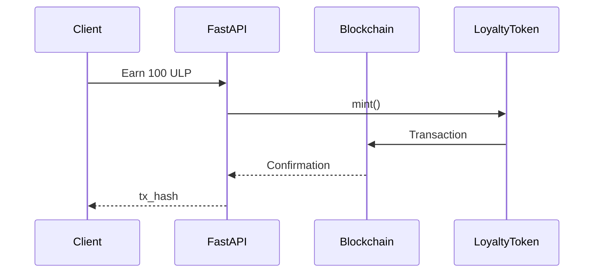

# Role

You are a senior Blockchain Architect and Python Full-Stack Engineer.

Build a complete educational demo of a **Multi-Partner Loyalty Point Blockchain Platform**.

The platform allows multiple independent businesses, such as:

* Coffee Shop
* Cinema
* Bank

to share a common loyalty-point ecosystem.

The entire demo must use **Python** for Client, Server, blockchain interaction, and smart-contract-related tooling wherever technically possible.

---

# Completed Implementation Notes

This workspace now contains a runnable scaffold for the requested demo:

- Solidity smart contract skeleton in [contracts/LoyaltyToken.sol](contracts/LoyaltyToken.sol)
- FastAPI backend in [server/main.py](server/main.py)
- SQLite-backed models in [server/models](server/models)
- Python CLI client in [client/main.py](client/main.py)
- Demo seed script in [scripts/seed_data.py](scripts/seed_data.py)
- Docker Compose in [docker-compose.yml](docker-compose.yml)

The implementation is intentionally educational and uses a simplified demo-wallet approach for local execution.

---

# 1. Main Business Scenario

We have three partners:

```text
Coffee Shop
Cinema
Bank
```

Each partner has its own backend/database conceptually, but they participate in a common loyalty ecosystem.

Example:

```text
Customer buys coffee
        ↓
Coffee Shop Backend
        ↓
Customer receives 100 Loyalty Points
        ↓
Blockchain
        ↓
Customer can use points at Cinema
```

Example:

```text
100 Coffee Points
        ↓
Universal Loyalty Point
        ↓
Cinema
        ↓
Redeem movie ticket
```

The goal is to demonstrate how multiple independent businesses can share loyalty points without directly sharing their databases.

---

# 2. Important Architecture Decision

Use a **single shared Loyalty Token Smart Contract** for the demo.

Architecture:

```text
                    Python Client
                         |
                         v
                 Python API Server
                         |
        +----------------+----------------+
        |                |                |
        v                v                v
   Coffee Service   Cinema Service   Bank Service
        |                |                |
        +----------------+----------------+
                         |
                         v
                Blockchain RPC
                         |
                         v
              Loyalty Smart Contract
                         |
                         v
                    Blockchain
```

The smart contract should represent a common loyalty token.

Use an ERC-20-compatible token concept.

Example:

```text
Token Name: Universal Loyalty Point
Symbol: ULP
Decimals: 18
```

---

# 3. Important Technical Constraint

There is an important distinction:

Python cannot natively implement an Ethereum smart contract.

Therefore:

* Smart contract MUST be written in Solidity.
* Everything else MUST be Python.
* Python must compile, deploy, call, and test the smart contract.

Use:

```text
Smart Contract:
Solidity

Client:
Python

Server:
Python

Blockchain interaction:
web3.py

Testing:
pytest

Blockchain development:
Hardhat or Anvil
```

Do NOT pretend that Solidity smart contracts can be written directly in Python.

Explain this clearly in the README.

---

# 4. Technology Stack

Use:

### Client

Python 3.12+

Use:

```text
Typer
httpx
rich
```

Create a CLI client instead of a GUI.

Example:

```bash
python client.py balance --wallet 0x123...

python client.py earn \
    --partner coffee \
    --amount 100

python client.py transfer \
    --to 0x456... \
    --amount 50

python client.py redeem \
    --partner cinema \
    --amount 100
```

The CLI should display clean, human-readable output.

---

### Server

Use:

```text
Python 3.12+
FastAPI
SQLAlchemy
SQLite
web3.py
Pydantic
uvicorn
```

The server provides REST APIs.

---

### Blockchain

Use:

```text
Anvil
web3.py
Solidity
OpenZeppelin ERC20
```

Use Anvil as the local blockchain.

---

### Testing

Use:

```text
pytest
pytest-asyncio
httpx
```

---

# 5. Project Structure

Create this complete project:

```text
loyalty-blockchain-demo/
│
├── README.md
├── docker-compose.yml
├── Makefile
├── .env.example
├── requirements.txt
│
├── contracts/
│   ├── LoyaltyToken.sol
│   └── deploy.py
│
├── server/
│   ├── main.py
│   ├── config.py
│   ├── database.py
│   │
│   ├── models/
│   │   ├── user.py
│   │   ├── partner.py
│   │   └── transaction.py
│   │
│   ├── schemas/
│   │   ├── user.py
│   │   ├── partner.py
│   │   └── transaction.py
│   │
│   ├── services/
│   │   ├── blockchain_service.py
│   │   ├── loyalty_service.py
│   │   └── settlement_service.py
│   │
│   └── api/
│       ├── users.py
│       ├── partners.py
│       ├── loyalty.py
│       └── transactions.py
│
├── client/
│   ├── main.py
│   ├── api_client.py
│   └── commands/
│       ├── user.py
│       ├── loyalty.py
│       └── partner.py
│
├── scripts/
│   ├── start_blockchain.sh
│   ├── deploy_contract.py
│   └── seed_data.py
│
└── tests/
    ├── test_contract.py
    ├── test_loyalty.py
    ├── test_partners.py
    └── test_api.py
```

Provide the FULL content of every important file.

Do not use pseudocode.

---

# 6. Smart Contract

Create:

```text
contracts/LoyaltyToken.sol
```

The contract must support:

```solidity
mint()
burn()
transfer()
balanceOf()
```

Only authorized partners or the platform administrator can mint/burn.

Use OpenZeppelin.

Implement role-based access control.

Use roles such as:

```text
DEFAULT_ADMIN_ROLE
MINTER_ROLE
BURNER_ROLE
PARTNER_ROLE
```

Do NOT use a single unrestricted `onlyOwner` implementation for the final architecture.

---

# 7. Partner Model

Create three partners:

```text
COFFEE
CINEMA
BANK
```

Each partner has:

```text
id
name
wallet_address
status
mint_permission
burn_permission
```

Example:

```json
{
  "id": "coffee",
  "name": "Coffee Shop",
  "wallet_address": "0x...",
  "status": "ACTIVE"
}
```

---

# 8. User Model

User:

```text
id
name
wallet_address
created_at
```

Do NOT store private keys in the database.

Private keys must only be used through environment variables for this local educational demo.

Clearly explain that production systems should use:

```text
HSM
Cloud KMS
MPC
Secure wallet infrastructure
```

instead of plain environment variables.

---

# 9. Loyalty Flow

Implement the following flow.

## Earn Point

Customer purchases coffee.

Request:

```http
POST /loyalty/earn
```

Body:

```json
{
  "user_wallet": "0x...",
  "partner": "coffee",
  "amount": 100,
  "reference": "ORDER-001"
}
```

Server:

```text
Validate partner
        ↓
Validate order/reference
        ↓
Call LoyaltyToken.mint()
        ↓
Wait for blockchain confirmation
        ↓
Store transaction in database
        ↓
Return transaction hash
```

Response:

```json
{
  "success": true,
  "amount": 100,
  "token": "ULP",
  "tx_hash": "0x..."
}
```

---

# 10. Check Balance

Implement:

```http
GET /loyalty/balance/{wallet}
```

Return:

```json
{
  "wallet": "0x...",
  "balance": "1000",
  "token": "ULP"
}
```

The balance should come from the blockchain.

---

# 11. Transfer Loyalty Point

Implement:

```http
POST /loyalty/transfer
```

Example:

```json
{
  "from": "0x...",
  "to": "0x...",
  "amount": 100
}
```

Explain an important security limitation:

The server cannot arbitrarily transfer tokens from a user's wallet unless it controls that wallet or the user provides a valid signature/approval.

For this educational demo, implement one of these approaches explicitly:

### Preferred

User signs the transaction.

OR

### Simplified demo

Use a server-controlled demo wallet and clearly label it as custodial.

Do not hide this distinction.

---

# 12. Redeem Point

Cinema wants to allow customers to redeem points.

Example:

```http
POST /loyalty/redeem
```

Body:

```json
{
  "user_wallet": "0x...",
  "partner": "cinema",
  "amount": 100,
  "reference": "TICKET-001"
}
```

Flow:

```text
User
 ↓
Cinema
 ↓
Redeem 100 ULP
 ↓
Smart Contract burn()
 ↓
Blockchain
 ↓
Database records redemption
```

Return:

```json
{
  "success": true,
  "amount": 100,
  "tx_hash": "0x..."
}
```

---

# 13. Exchange Rate

Implement a simple partner exchange-rate system.

Example:

```text
Coffee Point → ULP
1 Coffee Point = 1 ULP

Cinema
100 ULP = 1 Movie Ticket

Bank
100 ULP = 1 Bank Reward Voucher
```

Create an API:

```http
GET /partners
```

Return:

```json
[
  {
    "id": "coffee",
    "name": "Coffee Shop",
    "earn_rate": 1
  },
  {
    "id": "cinema",
    "name": "Cinema",
    "redeem_rate": 100
  },
  {
    "id": "bank",
    "name": "Bank",
    "redeem_rate": 50
  }
]
```

---

# 14. Settlement

This is an important part of the business architecture.

Suppose:

```text
Customer earns 100 ULP at Coffee Shop

then

Customer spends 100 ULP at Cinema
```

Cinema has provided value to the customer.

Coffee Shop and Cinema therefore need an off-chain settlement mechanism.

Create:

```text
settlement_service.py
```

Track:

```text
partner
points_issued
points_redeemed
net_position
```

Example:

```text
Coffee

Issued:
10,000 ULP

Redeemed:
2,000 ULP

Net:
+8,000
```

Cinema:

```text
Issued:
1,000 ULP

Redeemed:
8,000 ULP

Net:
-7,000
```

Explain that blockchain token transfer does NOT automatically solve the legal/accounting settlement between businesses.

---

# 15. Transaction History

Create:

```http
GET /loyalty/transactions/{wallet}
```

Return:

```json
[
  {
    "type": "EARN",
    "partner": "coffee",
    "amount": 100,
    "tx_hash": "0x...",
    "reference": "ORDER-001"
  },
  {
    "type": "REDEEM",
    "partner": "cinema",
    "amount": 100,
    "tx_hash": "0x...",
    "reference": "TICKET-001"
  }
]
```

---

# 16. Blockchain Service

Create:

```text
server/services/blockchain_service.py
```

It should encapsulate all web3.py logic.

Implement:

```python
get_balance()
mint()
burn()
transfer()
wait_for_transaction()
get_transaction()
```

Do not scatter web3.py calls throughout FastAPI route handlers.

Use dependency injection or a service class.

---

# 17. Environment Variables

Create:

```text
.env.example
```

Example:

```env
BLOCKCHAIN_RPC_URL=http://127.0.0.1:8545

LOYALTY_CONTRACT_ADDRESS=

ADMIN_PRIVATE_KEY=

MINTER_PRIVATE_KEY=

BURNER_PRIVATE_KEY=

DATABASE_URL=sqlite:///./loyalty.db
```

Add `.env` to `.gitignore`.

Never hardcode private keys.

---

# 18. Docker Compose

Create:

```text
docker-compose.yml
```

Run:

```text
Anvil
FastAPI
```

The project should be runnable with:

```bash
docker compose up
```

If running Anvil inside Docker creates networking issues, document the correct RPC hostname.

---

# 19. Demo Scenario

Create a complete demo script.

Run:

```bash
python scripts/seed_data.py
```

Then demonstrate:

```text
1. Create Alice

2. Alice gets wallet

3. Coffee Shop awards 500 ULP

4. Check Alice balance

5. Alice redeems 100 ULP at Cinema

6. Check Alice balance again

7. Show transaction history

8. Show partner settlement

9. Show blockchain transaction hashes
```

Expected result:

```text
Initial:
0 ULP

Coffee reward:
+500 ULP

Cinema redemption:
-100 ULP

Final:
400 ULP
```

---

# 20. Tests

Create comprehensive tests.

At minimum:

```text
test_token_mint
test_token_burn
test_token_transfer
test_unauthorized_mint
test_unauthorized_burn
test_earn_point
test_redeem_point
test_balance
test_transaction_history
test_partner
test_settlement
```

Also test:

```text
Cannot redeem more points than balance

Cannot mint by unauthorized partner

Cannot redeem by inactive partner

Cannot use duplicated transaction reference

Cannot use invalid wallet address

Cannot use negative amount
```

---

# 21. API Documentation

FastAPI should automatically expose:

```text
/docs
```

Document every endpoint.

Include request and response examples.

---

# 22. Security Requirements

Explain and implement:

### Smart Contract

* Access control
* Reentrancy protection where relevant
* Input validation
* Events
* Safe token operations
* Prevent unauthorized minting/burning

### Backend

* Validate wallet addresses
* Validate transaction references
* Idempotency
* Authentication placeholder
* Authorization
* Rate limiting discussion
* Private key security
* Blockchain transaction confirmation
* RPC failure handling
* Retry handling

### Important

Explain why the backend must NOT blindly trust:

```text
wallet address
transaction hash
client-provided amount
```

---

# 23. Smart Contract Events

Emit events such as:

```solidity
event LoyaltyMinted(
    address indexed partner,
    address indexed customer,
    uint256 amount,
    string reference
);

event LoyaltyRedeemed(
    address indexed partner,
    address indexed customer,
    uint256 amount,
    string reference
);
```

The backend should be able to read these events.

---

# 24. Blockchain vs Database

Clearly explain what belongs where.

### Blockchain

```text
Token balance
Token transfer
Mint
Burn
Transaction hash
On-chain events
```

### PostgreSQL / SQLite

```text
User profile
Partner profile
Order
Cinema ticket
Reward campaign
Settlement records
API metadata
Business rules
```

Do NOT store sensitive personal information directly on a public blockchain.

---

# 25. Architecture Diagram

Generate Mermaid diagrams for:

1. System architecture
2. Earn Point sequence
3. Redeem Point sequence
4. Settlement flow
5. Smart contract architecture

Example:



---

# 26. README

Create a very detailed README containing:

```text
Project Overview
Architecture
Why Blockchain
Why not only PostgreSQL?
Technology Stack
Prerequisites
Installation
Environment Setup
Start Anvil
Deploy Contract
Start Server
Start Client
Demo
API Documentation
Smart Contract Explanation
Security
Limitations
Production Architecture
```

Explain clearly:

> This is an educational demonstration and not a production financial system.

---

# 27. Production Architecture Discussion

At the end of README, explain how to evolve this demo into production.

Discuss:

```text
Permissioned Blockchain
Consortium Governance
HSM / KMS
MPC Wallet
Key Rotation
Multi-signature Administration
Event Indexer
Kafka
PostgreSQL
Redis
API Gateway
Observability
Settlement Engine
Fraud Detection
KYC/AML
Compliance
```

Also explain when blockchain should NOT be used.

---

# 28. Expected Output From You

Do NOT only provide snippets.

Generate the project step-by-step.

Output in this order:

## Step 1

Architecture explanation.

## Step 2

Complete project tree.

## Step 3

Smart contract code.

## Step 4

Smart contract deployment script.

## Step 5

FastAPI backend code.

## Step 6

Database models.

## Step 7

Blockchain service.

## Step 8

REST API.

## Step 9

Python CLI client.

## Step 10

Seed/demo script.

## Step 11

Tests.

## Step 12

Docker Compose.

## Step 13

README.

## Step 14

End-to-end demo commands.

---

# 29. Coding Rules

Use:

```text
Python 3.12+
Type hints
async/await where appropriate
Pydantic
SQLAlchemy
FastAPI
web3.py
pytest
```

Follow:

```text
PEP 8
Clean Architecture principles
SOLID
Separation of concerns
Dependency injection
```

Do not:

```text
Hardcode private keys
Hardcode contract addresses
Put blockchain code directly inside API routes
Store sensitive user information on-chain
Use pseudocode
Skip error handling
Skip tests
```

Every code example must be executable.

If a dependency/version is incompatible, choose a currently compatible version and explain why.

---

# 30. Final Goal

After following your instructions, I should be able to run:

```bash
docker compose up
```

deploy the smart contract:

```bash
python scripts/deploy_contract.py
```

start the API:

```bash
uvicorn server.main:app --reload
```

and execute:

```bash
python client/main.py balance

python client/main.py earn \
    --partner coffee \
    --amount 500

python client/main.py balance

python client/main.py redeem \
    --partner cinema \
    --amount 100

python client/main.py balance

python client/main.py history
```

The final demo must show:

```text
                ┌─────────────────┐
                │  Python Client  │
                └────────┬────────┘
                         │
                         ▼
                ┌─────────────────┐
                │     FastAPI     │
                └────────┬────────┘
                         │
              ┌──────────┴──────────┐
              ▼                     ▼
        ┌───────────┐       ┌──────────────┐
        │ SQLite/DB │       │  web3.py     │
        └───────────┘       └──────┬───────┘
                                   │
                                   ▼
                          ┌─────────────────┐
                          │ LoyaltyToken    │
                          │ Smart Contract  │
                          └────────┬────────┘
                                   │
                                   ▼
                              Anvil Chain
```

The most important learning objective is to understand exactly:

```text
Customer
   ↓
Partner
   ↓
FastAPI
   ↓
web3.py
   ↓
Smart Contract
   ↓
Blockchain
   ↓
Token Balance
```

and how **Coffee Shop, Cinema, and Bank can participate in the same loyalty ecosystem without sharing their internal databases**.
