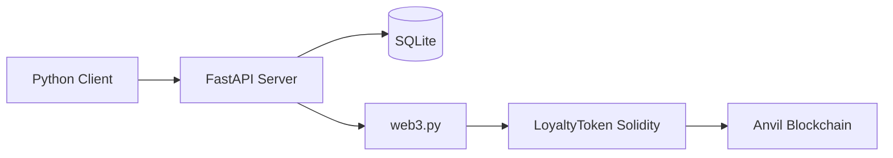

python3 -m pip install -r requirements.txt
./scripts/start_blockchain.sh
uvicorn server.main:app --reload
python3 scripts/seed_data.py
python3 client/main.py balance --wallet 0xabc

cd /Users/e-vuong.vuv/Documents/Code/Blockchain/LoyaltySmartContract

docker compose up --build -d
docker compose ps
docker compose logs -f api
http://localhost:8000/docs
docker compose exec api python scripts/seed_data.py
docker compose exec api python client/main.py balance --wallet 0xabc
docker compose exec api python client/main.py earn --partner coffee --amount 500 --wallet 0xabc
docker compose exec api python client/main.py balance --wallet 0xabc
docker compose exec api python client/main.py redeem --partner cinema --amount 100 --wallet 0xabc
docker compose exec api python client/main.py history --wallet 0xabc

docker compose down


# Multi-Partner Loyalty Point Blockchain Platform

This project is an educational demo showing how multiple independent businesses can participate in a shared loyalty ecosystem using a common ERC-20-style smart contract.

## Project Overview

The demo uses a single shared loyalty token contract named Universal Loyalty Point (ULP). Coffee Shop, Cinema, and Bank can all participate in the same token economy without sharing internal databases.

## Important Note About Solidity and Python

Python cannot natively implement an Ethereum smart contract. The smart contract must be written in Solidity and then deployed and interacted with from Python using web3.py. This repository follows that split clearly:

- Solidity: smart contract implementation
- Python: client, server, blockchain interaction, tests, deployment scripts

## Architecture



## Why Blockchain

Blockchain is used here to show a shared, auditable ledger of token balances and token mint/burn events. It is not meant to replace normal business systems such as order processing, CRM, accounting, or settlement.

## Why Not Only PostgreSQL or SQLite

A traditional database can track orders and rewards internally, but it cannot easily provide a shared, verifiable, interoperable token state across multiple partners. The blockchain layer adds a shared ledger and public transaction history for the token itself.

## Technology Stack

- Python 3.12+
- FastAPI
- SQLAlchemy
- SQLite
- Pydantic
- Typer
- Rich
- web3.py
- Solidity
- OpenZeppelin
- pytest
- Anvil

## Prerequisites

- Python 3.12+
- Docker (optional)
- Foundry/Anvil (optional for local development)

## Installation

```bash
python3 -m pip install -r requirements.txt
```

## Environment Setup

Copy the example environment file and customize it:

```bash
cp .env.example .env
```

## Start Anvil

```bash
./scripts/start_blockchain.sh
```

## Deploy Contract

The contract deployment script is provided as a placeholder for an educational environment. In a real setup, compile and deploy the Solidity contract with a tool such as Foundry or Hardhat.

```bash
python3 scripts/deploy_contract.py
```

## Start Server

```bash
uvicorn server.main:app --reload
```

## Start Client

```bash
python3 client/main.py balance
```

## Demo

```bash
python3 scripts/seed_data.py
python3 client/main.py balance --wallet 0xabc
python3 client/main.py earn --partner coffee --amount 500 --wallet 0xabc
python3 client/main.py balance --wallet 0xabc
python3 client/main.py redeem --partner cinema --amount 100 --wallet 0xabc
python3 client/main.py balance --wallet 0xabc
python3 client/main.py history --wallet 0xabc
```

## API Documentation

Open the FastAPI docs at:

- http://127.0.0.1:8000/docs

## Smart Contract Explanation

The contract uses role-based access control. Only authorized accounts can mint or burn loyalty tokens. The demo uses a simplified server-side wallet model for local education.

## Security

This is not a production financial system. It is an educational demo. In production, use:

- HSM / Cloud KMS
- MPC wallet infrastructure
- Key rotation
- Multi-signature administration
- Rate limiting
- Authentication and authorization

## Limitations

- The contract deployment script is an educational placeholder.
- The backend uses a simplified custodial wallet for the demo.
- The server does not implement full user authentication or a real signature-based transfer flow.

## Production Architecture

A production version would include a permissioned blockchain, consortium governance, event indexing, Kafka, PostgreSQL, Redis, API gateway, observability, and a formal settlement engine.
